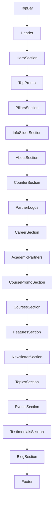

# 📄 Homepage Section Map (Reconciled)

> [!NOTE]
> This map has been updated to reflect the *actual* components built in the codebase, reconciling differences from initial planning templates.

## Current Actual Section Order (`page.tsx`)

| # | Component | Purpose | Status |
|---|---|---|---|
| 1 | `TopBar` | Contact info strip | ✅ Integrated |
| 2 | `Header` | Main navigation | ✅ Integrated |
| 3 | `HeroSection` | Hero banner (with Educa styling) | ✅ Integrated |
| 4 | `TopPromo` | Promo CTA banners | ✅ Integrated |
| 5 | `PillarsSection` | Services grid (Optima colors) | ✅ Integrated |
| 6 | `InfoSliderSection` | News photo slider (Optima style) | ✅ Integrated |
| 7 | `AboutSection` | Brand values / Rejoignez-nous | ✅ Integrated |
| 8 | `CounterSection` | Statistics | ✅ Integrated |
| 9 | `PartnerLogos` | Economic partner logos | ✅ Integrated |
| 10 | `CareerSection` | Career opportunities | ✅ Integrated |
| 11 | `AcademicPartners` | Academic partner logos | ✅ Integrated |
| 12 | `CoursePromoSection` | International pathways | ✅ Integrated |
| 13 | `CoursesSection` | Programmes (Licences & Masters) | ✅ Integrated |
| 14 | `FeaturesSection` | Why choose EBS (EBS Universe) | ✅ Integrated |
| 15 | `NewsletterSection` | Email signup | ✅ Integrated |
| 16 | `TopicsSection` | Certifications | ✅ Integrated (Repurposed) |
| 17 | `EventsSection` | Events | ✅ Integrated |
| 18 | `TestimonialsSection` | Testimonials | ✅ Integrated |
| 19 | `BlogSection` | Blog articles | ✅ Integrated |
| 20 | `Footer` | Full footer | ✅ Integrated |

## Component Name Resolution

*   **`OptimaServicesSection`** → Built as **`PillarsSection`**
*   **`NewsCardsSection`** → Built as **`InfoSliderSection`**
*   **`EbsBrandSection`** → Built as **`AboutSection`**
*   **`EbsUniverseSection`** → Built into **`FeaturesSection`**
*   **`EbsCertificationsSection`** → Built into **`TopicsSection`**

## Component File Locations

All section components: `src/components/sections/`
All layout components: `src/components/layout/`

## Section Dependencies

## Links
- [[Tech Stack & Architecture]]
- [[../02-Requirements/Batch 1 - Homepage Modifications|Batch 1 Details]]
